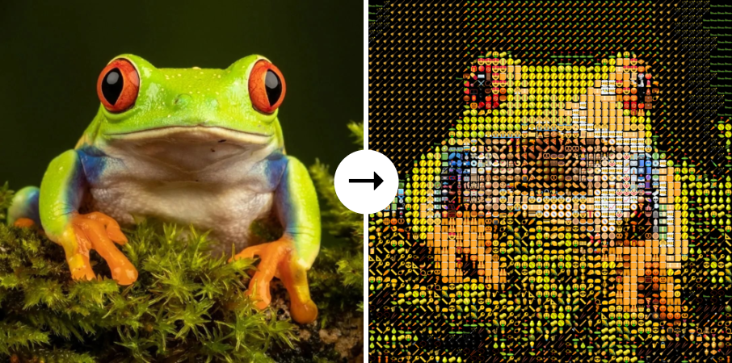

# Emoji art

Turn your picture into emoji art!



## Using

1. Copy this repository:
```bash
git clone https://github.com/Ostrill/emoji.git
```

2. Install required libraries:
```bash
pip install numpy==1.26.4
pip install pillow==10.2.0
```

3. Use it:
```Python
from utils import draw

draw(image='example.jpg',  # path to source image
     save_as='result.png') # path to save the emoji art
```

> More examples and details in [`documentation`](docs/EN.md)