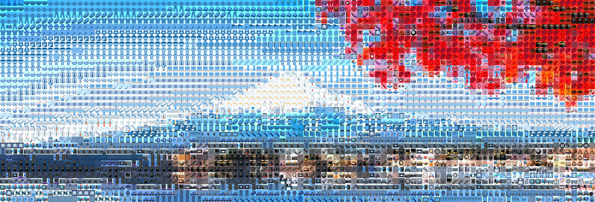

<h1><div align="right">
<code>🇺🇸</code> 
<a href="RU.md">🇷🇺</a>
</div>
Creating emoji arts
</h1>

The following concept is used to draw an emoji art:
1. Each pixel of the source picture is converted into the most appropriate emoji, so the the first step is resizing the picture to the required size.
2. Each emoji is a 50×50 pixel image. The average color in RGB channels is calculated for all its 2500 pixels.
3. For each pixel of the source picture, the emoji is selected, the average color of which is closest to the color of this pixel (closeness is determined by the Euclidean distance in RGB space).


## Examples

<details>
<summary>&nbsp;<strong>Using main method <code>draw()</code></strong></summary>
<blockquote></blockquote>
<blockquote>
If you just want to create an emoji art from your image, all you need is to use the <code>draw()</code> method from the <code>utils</code> module:<br><br>

```python
from utils import draw

draw(image='fuji.jpg',  # path to source image
     width=100,         # number of emojis in width
     background='auto', # background color
     styles='all',      # styles for emojis
     save_as='art.jpg') # path to save the result
```
The result:



<details>
<summary>&nbsp;Parameters of <code>draw()</code> method in details:</summary>
<blockquote></blockquote>
<ul>
<li><kbd>image</kbd> - path to source image;</li>
<li><kbd>width</kbd> - number of emojis in width <i>(default value is 50)</i>;</li>
<li><kbd>save_as</kbd> - path to save the result. If <i>None</i> is specified, result will not be saved <i>(default value is None)</i>;</li>
<li><kbd>styles</kbd> - each letter in this string stands for emoji style which will be used in art. For example, value <code>"ag"</code> means that Apple and Google emoji styles will be used. To select all styles, you can specify <code>"all"</code> <i>(default value is "all")</i>;
<blockquote></blockquote>
<table>
    <tr>
        <th>Letter</th>
        <th>Style</th>
        <th>Example</th>
    </tr>
    <tr>
        <td><code>"t"</code></td>
        <td>Twitter emoji style</td>
        <td></td>
    </tr>
    <tr>
        <td><code>"a"</code></td>
        <td>Apple emoji style</td>
        <td></td>
    </tr>
    <tr>
        <td><code>"g"</code></td>
        <td>Google emoji style</td>
        <td></td>
    </tr>
    <tr>
        <td><code>"f"</code></td>
        <td>Facebook emoji style</td>
        <td></td>
    </tr>
</table></li>
<li><kbd>pack</kbd> - path to pack of emojis to draw. All standard packs are in <code>data/</code> folder <i>(default value is "data/classic")</i>;
<blockquote></blockquote>
<table>
    <tr>
        <th>Pack</th>
        <th>Info</th>
        <th>Example</th>
    </tr>
    <tr>
        <td><code>"data/classic"</code></td>
        <td>A lot of different emojis</td>
        <td>😀 🍎 🚛</td>
    </tr>
    <tr>
        <td><code>"data/colors"</code></td>
        <td>Solid color emojis</td>
        <td>💚 🟥 🟣</td>
    </tr>
    <tr>
        <td><code>"data/flags"</code></td>
        <td>Rectangular countries flags</td>
        <td>🇷🇺 🇨🇳 🇯🇵</td>
    </tr>
    <tr>
        <td><code>"data/food"</code></td>
        <td>Different emojis about food</td>
        <td>🥝 🫐 🍷</td>
    </tr>
    <tr>
        <td><code>"data/love"</code></td>
        <td>Different emojis about love</td>
        <td>❤️‍🔥 🥰 💙</td>
    </tr>
    <tr>
        <td><code>"data/moon"</code></td>
        <td>Moon phases emojis</td>
        <td>🌖 🌗 🌘</td>
    </tr>
    <tr>
        <td><code>"data/all_flags"</code></td>
        <td>All emoji flags</td>
        <td>🏴‍☠️ 🚩 🎌</td>
    </tr>
</table></li>
<li><kbd>background</kbd> - the color of background as a tuple of RGB or RGBA values. if <i>None</i> is specified, transparent background will be applied (same effect as with alpha = 0 in RGBA). If you specify <code>"auto"</code>, the most suitable background for each emoji will be chosen, but it can take a lot of time! <i>(default value is (0, 0, 0, 255))</i>.</li>
</ul>
</details>
</blockquote>
</details>

<details>
<summary><strong>&nbsp;Creating your own emoji packs</strong></summary>
<blockquote></blockquote>
<blockquote>
If you wish, you can create your own emoji packs. To do this, you need to install the following libraries additionally:<br><br>

```bash
pip install pilmoji==2.0.4
pip install emoji==2.11.0
```
Then you need to use the <code>create_data()</code> method:

<details>
<summary>&nbsp;method code</summary>

```python
from PIL import Image, ImageFont, ImageDraw
from pilmoji import Pilmoji
from pilmoji.source import EmojiCDNSource
import numpy as np
import pickle


def create_data(emojis,
                size=50,
                save_as=None, 
                disp=True):
    """
    Create an dict containing all data to draw N 
    different emojis (which are specified in the
    first parameter of function). Structure of dict: 
    {
        'emojis': list of N emojis of str type,
        'styles': dict of 4 style names {number: stylename},
        'size': int (side of square image on which emojis are drawn),
        'matrices': np-array with shape (4, N, size, size, 4) of uint8,
    }

    PARAMETERS
    ----------
    emojis : list[str]
        list of emojis to build data

    size : int
        length of the side of the square image, on
        which emojis will be drawn

    save_as : str or None
        path to save data. If None is specified, data
        will not be saved
    
    disp : bool
        toggle progress displaing
    """
    
    def _str2style(name):
        """to convert style name to style class"""
        class StyleClass(EmojiCDNSource):
            STYLE = name
        return StyleClass
        
    # Quantity of emojis
    n_emojis = len(emojis)

    # Size of image with emoji
    esize = (size, size)
    
    data_dict = {
        'emojis': emojis,
        'styles': {0: 'twitter', 
                   1: 'apple', 
                   2: 'google', 
                   3: 'facebook'},
        'size': size,
        'matrices': np.zeros((4, n_emojis, *esize, 4), 
                             dtype='uint8')
    }

    # Style classes
    styles = [_str2style(data_dict['styles'][i]) for i in range(4)]

    for i, emoji in enumerate(emojis):
        for j, style in enumerate(styles):
            # Drawing an emoji on empty (0, 0, 0, 0) RGBA image
            with Image.new('RGBA', esize, 0) as image:
                font = ImageFont.truetype('arial.ttf', esize[0])
                with Pilmoji(image, source=style) as pilmoji:
                    pilmoji.text((0, 0), emoji, font=font)
                    
            # RGBA-matrix
            image_np = np.array(image)
            data_dict['matrices'][j, i] = image_np
            
            # Displaing the progress
            if disp:
                total = n_emojis * 4
                current = i * 4 + j + 1
                progress = f'{round(current / total * 100, 2)}%'
                print(f'\r{progress:<6} ({i+1}/{len(emojis)})', end='')
    if disp:
        print()

    # Saving as binary pickle file
    if save_as is not None:
        with open(f'{save_as}.pkl', 'wb') as file:
            pickle.dump(data_dict, file)

    return data_dict
```
</details>
Example of creating a pack from emojis ⚽️, 🏀, 🥎:<br><br>

```python
create_data(emojis=['⚽️', '🏀', '🥎'], # list of emoji
            size=50,                  # size of image for emoji
            save_as='data/sport',     # path to save
            disp=True)                # displaying the progress
```
</blockquote>
</details>