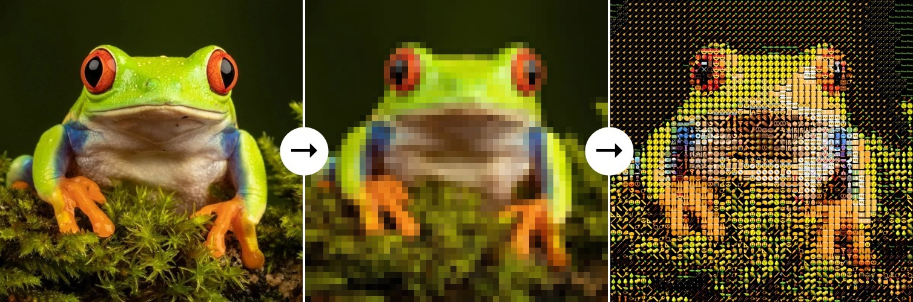
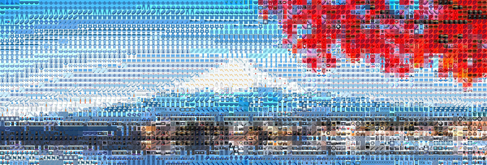

<h1><div align="right">
<a href="EN.md">🇺🇸</a>
<code>🇷🇺</code> 
</div>
Создание картинок из смайликов
</h1>

Для рисования картинки из смайликов используется следующий принцип:
1. Каждый пиксель исходной картинки преобразуется в наиболее подходящий ему смайлик, поэтому перед началом работы картинка уменьшается до требуемого размера.
2. Каждый смайлик представляет собой изображение 50×50 пикселей. Для всех его 2500 пикселей вычисляется средний цвет в каналах RGB.
3. Для каждого пикселя исходной картинки подбирается такой смайлик, средний цвет которого наиболее близок к цвету этого пикселя (близость определяется евклидовым расстоянием в пространстве RGB).



## Примеры

<details>
<summary>&nbsp;<strong>Использование главного метода <code>draw()</code></strong></summary>
<blockquote></blockquote>
<blockquote>
Если нужно просто создать картинку из смайликов, достаточно лишь использовать метод <code>draw()</code> из модуля <code>utils</code>:<br><br>

```python
from utils import draw

draw(image='fuji.jpg',  # путь к исходной картинке
     width=100,         # количество смайликов в ширину
     background='auto', # цвет фона
     styles='all',      # стили для смайликов
     save_as='art.jpg') # путь для сохранения
```
Результат:



<details>
<summary>&nbsp;Параметры функции <code>draw()</code> подробно:</summary>
<blockquote></blockquote>
<ul>
<li><kbd>image</kbd> - путь к файлу исходного изображения;</li>
<li><kbd>width</kbd> - количество смайликов в ширину <i>(значение по умолчанию: 50)</i>;</li>
<li><kbd>save_as</kbd> - путь для сохранения изображения результата. Если указать <i>None</i>, результат не будет никуда сохранен <i>(значение по умолчанию: None)</i>;</li>
<li><kbd>styles</kbd> - каждая буква в этой строке обозначает стиль для отрисовки смайликов. Например, если указать <code>"ag"</code>, то при рисовании картинки будут использоваться стили смайликов Google и Apple. Чтобы выбрать все стили, можно указать <code>"all"</code> <i>(значение по умолчанию: "all")</i>;
<blockquote></blockquote>
<table>
    <tr>
        <th>Буква</th>
        <th>Стиль</th>
        <th>Примеры</th>
    </tr>
    <tr>
        <td><code>"t"</code></td>
        <td>Стиль смайликов Twitter</td>
        <td></td>
    </tr>
    <tr>
        <td><code>"a"</code></td>
        <td>Стиль смайликов Apple</td>
        <td></td>
    </tr>
    <tr>
        <td><code>"g"</code></td>
        <td>Стиль смайликов Google</td>
        <td></td>
    </tr>
    <tr>
        <td><code>"f"</code></td>
        <td>Стиль смайликов Facebook</td>
        <td></td>
    </tr>
</table></li>
<li><kbd>pack</kbd> - путь к паку смайликов, которые будут использоваться для рисования картинки. Все стандартные паки находятся в папке <code>data/</code> <i>(значение по умолчанию: "data/classic")</i>;
<blockquote></blockquote>
<table>
    <tr>
        <th>Пак</th>
        <th>Описание</th>
        <th>Примеры</th>
    </tr>
    <tr>
        <td><code>"data/classic"</code></td>
        <td>Много разных смайликов</td>
        <td>😀 🍎 🚛</td>
    </tr>
    <tr>
        <td><code>"data/colors"</code></td>
        <td>Однотонные цветные смайлики</td>
        <td>💚 🟥 🟣</td>
    </tr>
    <tr>
        <td><code>"data/flags"</code></td>
        <td>Прямоугольные флаги стран</td>
        <td>🇷🇺 🇨🇳 🇯🇵</td>
    </tr>
    <tr>
        <td><code>"data/food"</code></td>
        <td>Разные смайлики с едой</td>
        <td>🥝 🫐 🍷</td>
    </tr>
    <tr>
        <td><code>"data/love"</code></td>
        <td>Разные смайлики про любовь</td>
        <td>❤️‍🔥 🥰 💙</td>
    </tr>
    <tr>
        <td><code>"data/moon"</code></td>
        <td>Смайлики фаз луны</td>
        <td>🌖 🌗 🌘</td>
    </tr>
    <tr>
        <td><code>"data/all_flags"</code></td>
        <td>Все флаги</td>
        <td>🏴‍☠️ 🚩 🎌</td>
    </tr>
</table></li>
<li><kbd>background</kbd> - цвет фона картинки в формате кортежа из трех или четырех значений RGB или RGBA соответственно. Если указать <i>None</i>, будет выбран прозрачный фон. Если указать <code>"auto"</code>, то цвет будет выбираться индивидуально для каждого смайлика так, чтобы наилучшим образом соответствовать исходной картинке. Но это может занять много времени! <i>(значение по умолчанию: (0, 0, 0, 255))</i>.</li>
</ul>
</details>
</blockquote>
</details>

<details>
<summary><strong>&nbsp;Генерация собственных паков смайликов</strong></summary>
<blockquote></blockquote>
<blockquote>
При желании можно можно создать собственные паки смайликов. Для этого необходимо дополнительно установить следующие библиотеки:<br><br>

```bash
pip install pilmoji==2.0.4
pip install emoji==2.11.0
```
Затем необходимо воспользоваться функцией <code>create_data()</code>:

<details>
<summary>&nbsp;код функции</summary>

```python
from PIL import Image, ImageFont, ImageDraw
from pilmoji import Pilmoji
from pilmoji.source import EmojiCDNSource
import numpy as np
import pickle


def create_data(emojis,
                size=50,
                save_as=None, 
                disp=True):
    """
    Создать словарь всех необходимых данных для
    рисования N разных смайликов (которые указаны
    в параметре emojis). Структура словаря:
    {
        'emojis': list of N emojis of str type,
        'styles': dict of 4 style names {number: stylename},
        'size': int (side of square image on which emojis are drawn),
        'matrices': np-array with shape (4, N, size, size, 4) of uint8,
    }

    PARAMETERS
    ----------
    emojis : list[str]
        список смайликов для формирования пака

    size : int
        размер стороны квадратного изображения, на
        котором будет отрисовываться каждый смайлик
        (в пикселях)

    save_as : str или None
        путь для сохранения пака. Если указать None,
        пак не будет никуда сохранен, а только
        вернется в качестве результата функции
    
    disp : bool
        индикация прогресса создания пака
    """
    
    def _str2style(name):
        """Конвертировать название стиля в класс"""
        class StyleClass(EmojiCDNSource):
            STYLE = name
        return StyleClass
        
    # Количество смайликов в паке
    n_emojis = len(emojis)

    # Размер изображения смайлика
    esize = (size, size)
    
    data_dict = {
        'emojis': emojis,
        'styles': {0: 'twitter', 
                   1: 'apple', 
                   2: 'google', 
                   3: 'facebook'},
        'size': size,
        'matrices': np.zeros((4, n_emojis, *esize, 4), 
                             dtype='uint8')
    }

    # Классы для стилей смайликов
    styles = [_str2style(data_dict['styles'][i]) for i in range(4)]

    for i, emoji in enumerate(emojis):
        for j, style in enumerate(styles):
            # Рисование смайлика на пустом (0, 0, 0, 0) RGBA-изображении
            with Image.new('RGBA', esize, 0) as image:
                font = ImageFont.truetype('arial.ttf', esize[0])
                with Pilmoji(image, source=style) as pilmoji:
                    pilmoji.text((0, 0), emoji, font=font)
                    
            # RGBA-матрица
            image_np = np.array(image)
            data_dict['matrices'][j, i] = image_np
            
            # Вывод прогресса
            if disp:
                total = n_emojis * 4
                current = i * 4 + j + 1
                progress = f'{round(current / total * 100, 2)}%'
                print(f'\r{progress:<6} ({i+1}/{len(emojis)})', end='')
    if disp:
        print()

    # Сохранение пака в виде бинарного файла
    if save_as is not None:
        with open(f'{save_as}.pkl', 'wb') as file:
            pickle.dump(data_dict, file)

    return data_dict
```
</details>
Пример создания пака из смайликов ⚽️, 🏀, 🥎:<br><br>

```python
create_data(emojis=['⚽️', '🏀', '🥎'], # список смайликов
            size=50,                  # размер изображения смайлика
            save_as='data/sport',     # путь для сохранения
            disp=True)                # индикация прогресса
```
</blockquote>
</details>